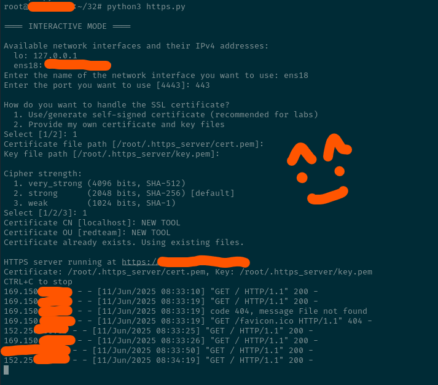

# sHTTPSserver
Simple HTTPs Python Server :D

<p align="center">
  
</p>


# Minimal Red Team HTTPS Server

A minimal HTTPS file/web server written in Python 3, designed for **red team operations**, labs, and pentesting.

- Serve any directory with HTTPS on any interface and port.
- Generate self-signed certificates, or use your own.
- Choose certificate strength and details on the fly.
- All certificate files are stored **safely out of web root** (by default: `~/.https_server/`).
- **Fully interactive mode:** If you run with no arguments, the script will walk you through every option, making it beginner-proof.
- All flags and usage explained below!

---

## Why use this?

- Some vulnerabilities can only be exploited if you serve payloads or files **over HTTPS**.
- Many targets require SSL for C2 beacons, staging, phishing, or file drops (e.g., modern browsers block HTTP).
- You might obtain a valid cert/private key from the target—this tool lets you use it instantly.
- Needed for testing bugs that require custom CN/OUs or specific ciphers in the certificate.
- Great for **quick, on-the-go HTTPS servers** in labs or engagements, without leaking certs/keys via webroot.

---

<p align="center">
  
</p>


## Quick start

Serve the current directory on interface `ens18` and port `443` (will prompt for missing info):

    python3 https_server.py --int ens18 --port 443

Or just run:

    python3 https_server.py

and the script will interactively guide you through all options: interface, port, cert/key, cipher, etc.

---

## Command Line Options

Show all available flags and descriptions:

    python3 https_server.py -h

You’ll see:

    usage: https_server.py [-h] [--int INT] [--port PORT] [--list-interfaces]
                           [--cert CERT] [--key KEY] [--generate-cert]
                           [--cert-cn CERT_CN] [--cert-ou CERT_OU]
                           [--cert-level {very_strong,strong,weak}]

    Minimal HTTPS server for Red Team, labs, or dev. Lets you pick interface, port,
    and SSL options, with safe certificate storage.

    options:
      -h, --help            show this help message and exit
      --int INT             Network interface to bind (e.g., ens18, lo)
      --port PORT           Port to bind (default: 4443)
      --list-interfaces     List available interfaces and exit
      --cert CERT           Path to certificate file (PEM)
      --key KEY             Path to private key file (PEM)
      --generate-cert       Force generating a new self-signed certificate
      --cert-cn CERT_CN     Common Name (CN) for generated certificate (default: localhost)
      --cert-ou CERT_OU     Organizational Unit (OU) for generated certificate (default: redteam)
      --cert-level {very_strong,strong,weak}
                            Cipher strength for generated certificate (default: strong)

---

## Examples

List all network interfaces and their IPv4s:

    python3 https_server.py --list-interfaces

Serve current dir over HTTPS on ens18:4443, auto-generating a self-signed cert:

    python3 https_server.py --int ens18 --port 4443

Use your own cert and key files (great if you pwned them from the target):

    python3 https_server.py --int ens18 --port 8443 --cert /tmp/victim.crt --key /tmp/victim.key

Generate a very strong cert with custom CN/OU (for phishing/c2):

    python3 https_server.py --int ens18 --port 443 --generate-cert --cert-level very_strong --cert-cn login.targetcorp.com --cert-ou finance

Interactive mode (beginner friendly):

    python3 https_server.py

You will be prompted to select interface, port, cert options, and cipher level.

---

## Security Notes

- **Certs and keys are stored in `~/.https_server/` by default.**
  They are never dropped in your web root, so they cannot be leaked by a web crawler or user download.
- Never use self-signed certs for real production—this is for red team, dev, and lab use.
- You can safely use this with *any* cert/key pair you control, for any ops.

---

## Typical Use Cases

- Drop malicious payloads over HTTPS for exploits or malware delivery.
- Test SSRF/RFI/XXE/file upload bugs that require HTTPS.
- Host C2 beacons or phishing pages in a way that bypasses browser restrictions on HTTP.
- Use stolen or spoofed certs for **red team evasion** and target impersonation.
- Super quick HTTPS file transfer in labs and real-world scenarios.

---

## Why HTTPS for Red Team & Labs?

- **Some vulnerabilities and attack paths are only possible when the payload is served via HTTPS.** Many real-world infrastructure and corporate targets will block or refuse non-SSL connections, especially for downloads, uploads, browser interaction, and C2 callbacks.
- **If you compromise a target and obtain their private certificate and key, you can instantly spin up a perfect clone of their service for phishing, staging, or other ops.** This tool lets you do that in seconds.
- **Modern browsers and apps increasingly reject HTTP outright** (for example, via HSTS, CORS policies, etc). You need HTTPS to exploit or test many current bugs and scenarios.

---

## All Options Explained (-h output)

Run:

    python3 https_server.py -h

You’ll see:

    usage: https_server.py [-h] [--int INT] [--port PORT] [--list-interfaces]
                           [--cert CERT] [--key KEY] [--generate-cert]
                           [--cert-cn CERT_CN] [--cert-ou CERT_OU]
                           [--cert-level {very_strong,strong,weak}]

    Minimal HTTPS server for Red Team, labs, or dev. Lets you pick interface, port,
    and SSL options, with safe certificate storage.

    options:
      -h, --help            show this help message and exit
      --int INT             Network interface to bind (e.g., ens18, lo)
      --port PORT           Port to bind (default: 4443)
      --list-interfaces     List available interfaces and exit
      --cert CERT           Path to certificate file (PEM)
      --key KEY             Path to private key file (PEM)
      --generate-cert       Force generating a new self-signed certificate
      --cert-cn CERT_CN     Common Name (CN) for generated certificate (default: localhost)
      --cert-ou CERT_OU     Organizational Unit (OU) for generated certificate (default: redteam)
      --cert-level {very_strong,strong,weak}
                            Cipher strength for generated certificate (default: strong)

Pro tip:
- If you run with NO arguments, everything will be interactive (interface, port, cert, key, cipher, CN/OU).
- If you only want to see interfaces: --list-interfaces.

---

## Contributions

PRs welcome.
Script tested on Kali, Ubuntu, Debian, RHEL, FreeBSD (with little tweaks) and most Linux systems with Python 3 and openssl.

---

## Author

Ⓐ
I DONT FUCKING CARE IF YOU WANT TO - 
fork, improve, and break things EVEN making money with it. JUST DO IT. 
Happy hunting!
Ⓐ

```

⠀⠀⠀⠀⠀⠀⠀⠀⠀⠀⡀⠀⠀⠀⠀⠀⠀⠀⠀⠀⠀⠀⠀⠀⠀⠀⠀⠀
⠀⠀⠀⠀⠀⠀⠀⠀⠀⢠⣾⡄⠀⠀⠀⠀⠀⠀⠀⠀⠀⠀⠀⠀⠀⠀⠀⠀
⠀⠀⠀⠀⠀⠀⠀⠀⢀⣼⣿⣧⣶⣶⣶⣦⣤⣀⡀⠀⠀⠀⠀⠀⠀⠀⠀⠀
⠀⠀⠀⠀⠀⠀⣠⣾⢿⣿⣿⣿⣏⠉⠉⠛⠛⠿⣷⣕⠀⠀⠀⠀⠀⠀⢀⡀
⠀⠀⠀⠀⣠⣾⢝⠄⢀⣿⡿⠻⣿⣄⠀⠀⠀⠀⠈⢿⣧⡀⣀⣤⡾⠀⠀⠀
⠀⠀⠀⢰⣿⡡⠁⠀⠀⣿⡇⠀⠸⣿⣾⡆⠀⠀⣀⣤⣿⣿⠋⠁⠀⠀⠀⠀
⠀⠀⢀⣷⣿⠃⠀⠀⢸⣿⡇⠀⠀⠹⣿⣷⣴⡾⠟⠉⠸⣿⡇⠀⠀⠀⠀⠀
⠀⠀⢸⣿⠗⡀⠀⠀⢸⣿⠃⣠⣶⣿⠿⢿⣿⡀⠀⠀⢀⣿⡇⠀⠀⠀⠀⠀
⠀⠀⠘⡿⡄⣇⠀⣀⣾⣿⡿⠟⠋⠁⠀⠈⢻⣷⣆⡄⢸⣿⡇⠀⠀⠀⠀⠀
⠀⠀⠀⢻⣷⣿⣿⠿⣿⣧⠀⠀⠀⠀⠀⠀⡀⠻⣿⣷⣿⡟⠀⠀⠀⠀⠀⠀
⢀⣰⣾⣿⠿⣿⣿⣾⣿⠇⠀⠀⠀⠀⠀⠀⠀⢀⣼⣿⣿⣅⠀⠀⠀⠀⠀⠀
⠀⠰⠊⠁⠀⠙⠪⣿⣿⣶⣤⣄⣀⣀⣀⣤⣶⣿⠟⠋⠙⢿⣷⡄⠀⠀⠀⠀
⠀⠀⠀⠀⠀⠀⢀⣿⡟⠺⠭⠭⠿⠿⠿⠟⠋⠁⠀⠀⠀⠂⠙⠏⣦⠀⠀⠀
⠀⠀⠀⠀⠀⠀⢸⡟⠃⠀⠀⠀⠀⠀⠀⠀⠀⠀⠀⠀⠀⠀⠀⠀⠀⠀⠀⠀
⠀⠀⠀⠀⠀⠀⠀⠁⠀⠀⠀⠀⠀⠀⠀⠀⠀⠀⠀⠀⠀⠀⠀⠀⠀⠀⠀⠀

```
🚫📜⚖️
